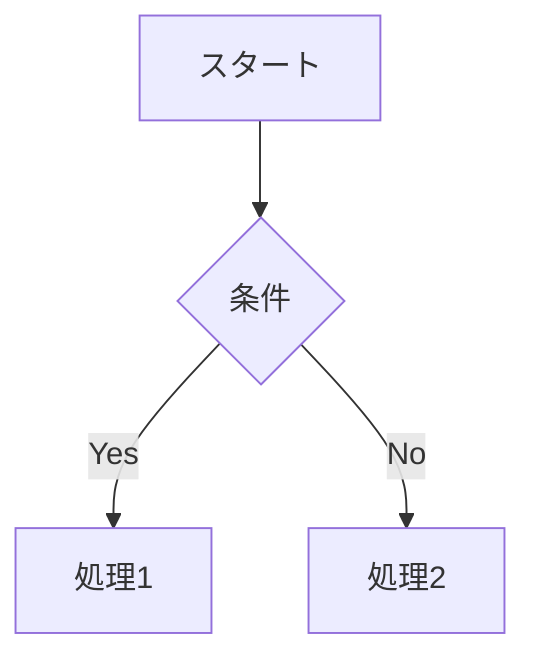
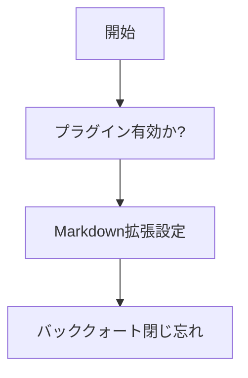

# Mermaid テスト



> ❗**注意：3重バッククォート (\`\`\`) を閉じ忘れないようにすること！**

---

###  プレビュー表示を有効にする

- Markdown ファイルを開いた状態で、右上に表示される 👁️ アイコン（**「Open Preview」または「Split Preview」**）をクリック

または
- `⌘ + ⇧ + A`（または Windowsでは `Ctrl + Shift + A`）で「Open Preview」を検索して起動

---

###  Mermaid 図が表示されるか確認

- グラフ（フローチャート）が表示されれば成功です！
- 表示されない場合は以下を確認してください👇

---

## ✅ Mermaid が動かないときのチェックポイント

| 項目           | 内容                                                                                                            |
|--------------|---------------------------------------------------------------------------------------------------------------|
| プラグイン有効か？    | `Preferences > Plugins > Installed` で `Mermaid` プラグインが有効になっているか                                               |
| Markdown拡張設定 | `Preferences > Languages & Frameworks > Markdown > Markdown Extensions` に **Mermaid チェックがあるか**（ある場合はチェックを入れる） |
| バッククォート閉じ忘れ  | ` ```mermaid` で始まったら ` ``` ` で閉じているか？                                                                         |

---

## 💡 補足：Mermaidを正しく書くためのテンプレ


